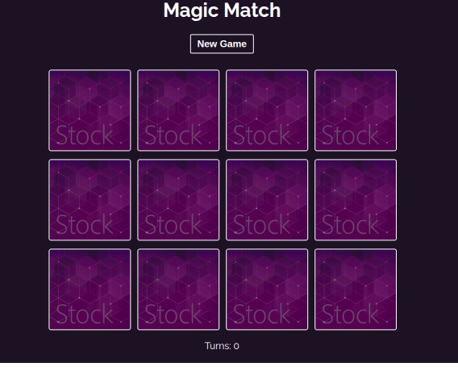

### **Project deployed [here](https://fmarcio.github.io/memory-game)**



# Magic Match - Memory Game

A polished, responsive memory matching game built with **React** and **TypeScript**. Test your memory by finding all matching pairs of magical artifacts in the fewest turns possible.

This project is inspired by The Net Ninja (Shaun Pelling) React course but with some additional features and code improvements added by myself. Gemini was used for helping debugging and fastening development.

## ✨ Features

- **Core Gameplay:** Smooth card flipping animations and matching logic.
- **Game Progression:** Tracks the number of turns taken to complete the game.
- **Robust Logic:**
  - Prevents "cheating" via rapid double-clicking.
  - Automatically disables card interaction during evaluation delays.
- **Responsive Design:** Mobile-first approach using CSS Grid and media queries (optimized for desktop, tablet, and mobile).
- **Modern Tooling:** Migrated from CRA to **Vite** and **React 18** for a lightning-fast development experience and optimized builds. Includes a comprehensive unit test suite using **Vitest**.

## 🛠️ Tech Stack

- **Framework:** React 18
- **Bundler:** Vite
- **Language:** TypeScript (Strict typing for robust code)
- **Styling:** Vanilla CSS (Custom animations and transitions)
- **Testing:** Vitest & React Testing Library

## 🚀 Getting Started

### Prerequisites

- [Node.js](https://nodejs.org/) (v18 or higher recommended)
- npm (comes with Node.js)

### Installation

1. Clone the repository:
   ```bash
   git clone https://github.com/your-username/magic-memory.git
   ```
2. Navigate to the project folder:
   ```bash
   cd magic-memory
   ```
3. Install dependencies:
   ```bash
   npm install
   ```

### Available Scripts

- **`npm start`**: Runs the app in development mode using Vite.
- **`npm test`**: Launches the Vitest runner.
- **`npm run build`**: Builds the app for production to the `dist` folder.

## 🚀 Deployment

This project is configured for easy deployment to **GitHub Pages**.

To deploy the app:

1. Ensure your changes are committed and pushed to your GitHub repository.
2. Run the deployment script:
   ```bash
   npm run deploy
   ```
   This will automatically build the project and push it to a `gh-pages` branch on GitHub.

## 🧪 Testing

The project includes a suite of unit tests to ensure the game mechanics are reliable. These tests cover:

- Component rendering and initial state.
- Card shuffling and state management.
- Matching logic and turn handling.
- Win conditions and UI transitions.

To run the tests:

```bash
npm test
```

## 📝 Learning Objectives

This project served as a deep dive into:

1. **React State Management:** Handling complex state transitions with `useState` and `useEffect`.
2. **TypeScript Integration:** Implementing custom types and interfaces for a safer development experience.
3. **Dependency Management:** Upgrading legacy projects to modern standards (`Webpack 5`, `OpenSSL` compatibility).
4. **Unit Testing:** Writing meaningful tests for interactive UI components.
